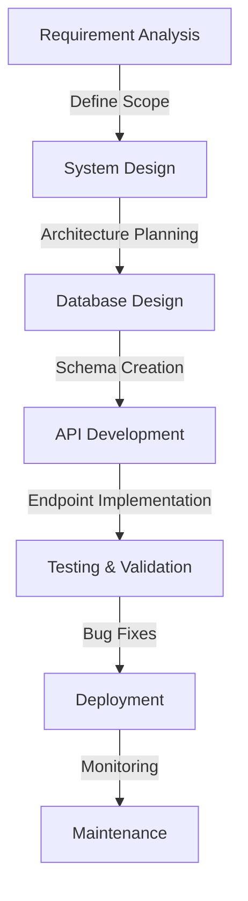

<h1 align="center">
  
</h1>

<h1 align="center">
  
</h1>

  

<h2 align="center">✨ About Me ✨</h2>

- 👨‍💻 Hello! I'm **Deepak**, a Software Engineer who designs and develops scalable APIs, databases, and backend architectures for web applications.

- 🎓 I graduated from **IIT Hyderabad** in 2022 with a degree in Civil Engineering, but my passion for technology led me to pursue a career in software development.

- 💼 My expertise includes building REST APIs, database design, backend development, and creating efficient system architectures.

- 🧠 Currently working on multiple Full Stack Development projects involving both frontend and backend.

- 🌟 I'm a passionate Software Engineer fueled by technology, creativity, and curiosity.

- 🎮 When I'm not coding, you'll find me exploring space, drumming, gaming, or on the football field.

- 💡 I find rhythm in problem solving and inspiration in everything around me.

<h2 align="center">📝 Education 📝</h2>

  <table>
    <tr>
      <td>
        <strong>Bachelor of Technology in Civil Engineering</strong> 
        Indian Institute of Technology, Hyderabad 
        July 2018 – May 2022
      </td>
    </tr>
  </table>

<h2 align="center">🔍 Current Focus 🔍</h2>

  <table>
    <tr>
      <td align="center">Full Stack Development – both Frontend and Backend</td>
    </tr>
  </table>

<h2 align="center">💪 Professional Skills 💪</h2>

  <table>
    <tr>
      <td align="center">
        
        
React, HTML5, CSS3, JavaScript, Bootstrap, Responsive Design

      </td>
      <td align="center">
        
        
REST API Design, Node.js, Express, .NET Core, Server Architecture

      </td>
    </tr>
    <tr>
      <td align="center">
        
        
MySQL, PostgreSQL, MongoDB, Schema Design, Query Optimization

      </td>
      <td align="center">
        
        
Algorithmic Thinking, Debugging, Scalable Systems, API Integration

      </td>
    </tr>
  </table>

<h2 align="center">🌍 Languages I Speak 🌍</h2>

  <table>
    <tr>
      <td align="center">Telugu (Native)</td>
      <td align="center">English (Advanced)</td>
      <td align="center">Hindi (Basic)</td>
      <td align="center">Spanish (Basic)</td>
    </tr>
  </table>

<h2 align="center">🛠️ Tech Stack & Tools 🛠️</h2>

  
  
  
  
  
  

  
  
  
  

  
  
  
  

  
  
  
  

  
  
  

<h2 align="center">💻 Development Workflow 💻</h2>

  

<h2 align="center">🚀 Featured Projects 🚀</h2>

  <table>
    <tr>
      <td width="50%">
        <h3 align="center">IMDb Relational Database REST API</h3>
        

          
        

        
A comprehensive movie database with a REST API and web interface, allowing users to browse movies, actors, and reviews. Built with Flask and MySQL.

        
<strong>Tech Stack:</strong> Python, Flask, MySQL, RESTful API, Swagger

      </td>
      <td width="50%">
        <h3 align="center">Raw Socket Firewall with Packet Inspection</h3>
        

          
        

        
A network security tool implementing a firewall using raw socket programming with advanced packet inspection capabilities.

        
<strong>Tech Stack:</strong> C++, Linux, Networking Protocols

      </td>
    </tr>
    <tr>
      <td width="50%">
        <h3 align="center">Online Code Compiler & Debugger</h3>
        

          
        

        
A web-based tool that allows users to write, compile, and debug code in multiple programming languages directly in the browser.

        
<strong>Tech Stack:</strong> JavaScript, Node.js, Express, Docker

      </td>
      <td width="50%">
        <h3 align="center">Swarm Robotics for Task Coordination</h3>
        

          
        

        
A swarm robotics system that coordinates multiple robots to perform complex tasks through distributed algorithms and communication protocols.

        
<strong>Tech Stack:</strong> Python, ROS, Machine Learning, Simulation

      </td>
    </tr>
    <tr>
      <td width="50%">
        <h3 align="center">Dating Website With Matchmaking Algorithm</h3>
        

          
        

        
A dating platform featuring a sophisticated matchmaking algorithm that pairs users based on compatibility factors, preferences, and interests.

        
<strong>Tech Stack:</strong> JavaScript, Node.js, React, MongoDB

      </td>
      <td width="50%">
        <h3 align="center">ATS Resume Checker</h3>
        

          
        

        
A tool that analyzes resumes against job descriptions to determine ATS compatibility and provides suggestions for optimization.

        
<strong>Tech Stack:</strong> Python, NLP, Machine Learning

      </td>
    </tr>
  </table>

<h2 align="center">📊 GitHub Stats 📊</h2>

  

  

  

  

  

  <h2>🔄 Random Dev Quote 🔄</h2>
  

<h2 align="center">🎵 Activity Graph 🎵</h2>

  

  <h2>📄 View My Resume 📄</h2>
  

<h2 align="center">🐍 Contribution Snake 🐍</h2>

  

  

